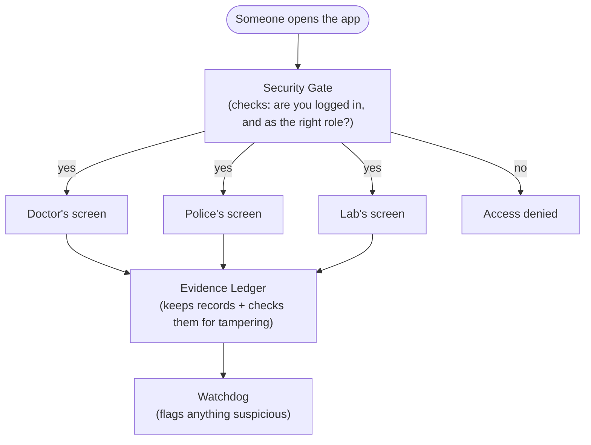
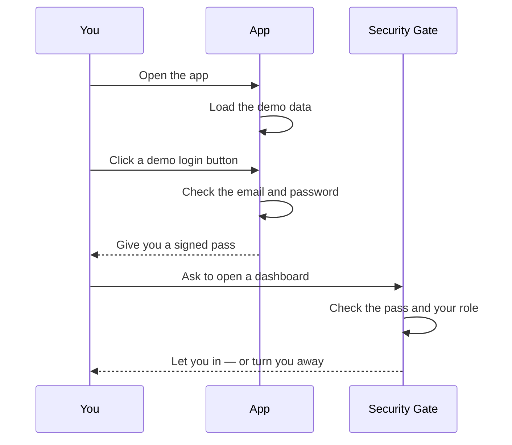
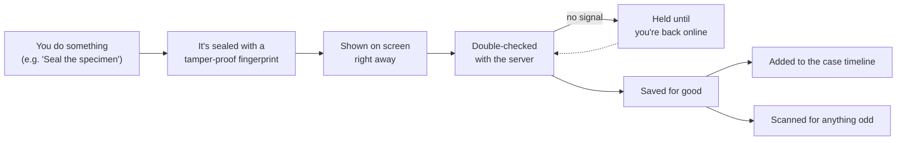
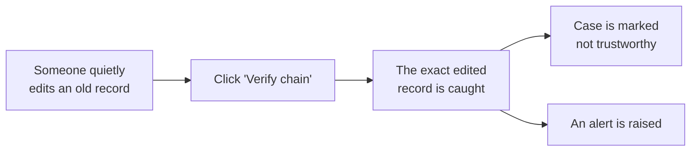

# Project96

After a sexual-assault examination, the evidence collected doesn't stay in
one pair of hands — it moves from a medical officer, to a police
investigating officer, to a forensic lab, often across different people,
shifts, and buildings. India already has clear protocols for how that
handoff is *supposed* to happen. What's much harder to prove, after the
fact, is whether it actually happened that way: was the seal really intact
when it changed hands? Did twelve hours quietly turn into two days
somewhere in transit? Did the specimen count match at every step?

Project96 makes that chain verifiable instead of just documented. Every
handoff gets a real cryptographic seal, every step is timestamped and
hashed onto the one before it, and a tampered record doesn't just look
suspicious — it fails a live integrity check and says exactly where it
broke. Built in a single sitting for **VMEDITHON 3.0** (VIT Chennai,
Bio × Engineering track).

> Demonstration prototype — synthetic data only. Not for use with real case
> material.

**Live demo:** [shpp1.vercel.app](https://shpp1.vercel.app)

---

## What it does, in five bullets

- Guides a Medical Officer through a fixed collection sequence they cannot skip or reorder.
- Seals each case with a signed QR code that a Police officer scans (or pastes) to verify five things before accepting custody.
- Chains every event to the one before it with SHA-256, so any after-the-fact edit is mathematically detectable.
- Keeps working with no network — actions queue locally and sync the moment connectivity returns.
- Flags suspicious patterns on its own: mismatched seals, missing steps, and handoffs that took too long.

---

## Architecture



> **Why no database?** On purpose. Every record lives inside its own
> tamper-proof fingerprint chain, and the server's only job is to check
> who's allowed to do what. Nothing important is hidden behind extra
> infrastructure — it's easy to point at the two files that matter and
> say "this is the real security." Full honest breakdown in
> [`SECURITY.md`](SECURITY.md).

---

## Sequence: signing in and loading a dashboard



> **Why this matters.** The check happens before a page is even sent to
> you — not as a rule the page itself enforces, which could be tricked.
> Try it: log in as Police, then paste a Medical Officer link into the
> address bar. You're blocked before any of that content ever loads.

---

## Data flow: recording one custody event



> **Why offline-first.** A hospital basement or a police van doesn't
> always have signal. Nothing here waits for the network — you see your
> action instantly, and it quietly syncs whenever a connection shows up.
> Try it: flip "Simulate offline," record a step, watch it queue, flip
> back online, watch it sync.

---

## The tamper demo (the actual point of the project)

Open any completed case as FSL, click **Verify chain** — it recomputes
every hash from the beginning and reports `INTACT`. Then use the dev-only
control on that same page to silently alter one historic event, and click
**Verify chain** again:



> **This is the whole pitch, in one click.** Protocols describe what
> *should* happen. This proves what *did* happen — and points at the
> exact moment it stopped being trustworthy.

---

## Demo logins

All three accounts use the password **`Demo@2026`**, or click the matching
"Demo login" button on the sign-in screen. There's also a **"View demo
dashboard"** button that skips sign-in entirely and drops you straight
into the fullest view (FSL).

| Role | Email | Name |
|---|---|---|
| Medical Officer | `dr.meera@ghc.gov.in` | Dr. Meera Ravikumar, Govt. Hospital, Chennai |
| Police IO | `io.rajan@tnpolice.gov.in` | SI R. Rajan, Guindy Police Station |
| FSL / Admin | `admin@fsl.tn.gov.in` | Dr. A. Krishnan, Regional FSL Chennai |

## Demo script (6 steps, no terminal needed)

1. **Log in as Medical Officer** → open case `SAEC-2026-0147` → walk the
   stepper (consent → kit opened → specimens → labelled → packed) → seal →
   a QR appears with its signed payload printed beneath it.
2. **Toggle "Simulate offline"** in the nav rail footer → commit a custody
   event → see it marked `QUEUED` and the top-bar pill switch to `OFFLINE`
   → toggle back online → watch it sync.
3. **Log out, log in as Police IO** → *Receive evidence* → paste the QR
   payload from an already-sealed case (e.g. `SAEC-2026-0142`) and its
   transfer code → watch the five verification lines pass → accept custody.
4. **Paste an `/mo/...` URL** into the address bar while still logged in
   as Police → blocked at `/403`.
5. **Log in as FSL** → open any completed case (`SAEC-2026-0146`) →
   *Custody timeline* → **Verify chain** → `INTACT`.
6. **Open the dev-only tamper control** → apply it to any historic event
   → **Verify chain** again → break detected, exact event named, anomaly
   raised, case flagged `INTEGRITY COMPROMISED`.

## Project layout

```
src/
  lib/          chain.ts, crypto.ts, session.ts, store.ts, anomalies.ts,
                seed.ts, offlineQueue.ts, actions.ts, types.ts
  middleware.ts edge-enforced route/role guard
  app/          login/, 403/, api/, mo/, police/, fsl/
  components/   nav/, ui/, fsl/
```

See [`SECURITY.md`](SECURITY.md) for exactly what's real cryptography vs.
simplified for the demo, and [`NOTES.md`](NOTES.md) for build-time
assumptions.

## Local development

```bash
npm install
npm run dev
```

## Build

```bash
npm run build
```

Passes with zero TypeScript errors and zero ESLint errors/warnings.

## Deploy

Already live at [shpp1.vercel.app](https://shpp1.vercel.app), auto-deploying
from this repository's `main` branch. To deploy your own copy: import this
repo at [vercel.com/new](https://vercel.com/new) — no environment variables
needed, Next.js is auto-detected.
